# A.E.S - Bizzy Architecture Analysis

**Document Version:** 1.1
**Analysis Date:** 2025-12-24
**Last Updated:** 2025-12-24 (Added claude-subagents analysis)
**Scope:** Complete system architecture, data flows, and integration points

---

## Table of Contents

1. [Executive Summary](#executive-summary)
2. [System Overview](#system-overview)
3. [Core Architecture Diagrams](#core-architecture-diagrams)
4. [Component Deep Dive](#component-deep-dive)
5. [Claude-Subagents System](#claude-subagents-system) *(Critical Component)*
6. [Data Flow Analysis](#data-flow-analysis)
7. [Heimdall Memory System Integration](#heimdall-memory-system-integration)
8. [Gap Analysis](#gap-analysis)
9. [Issues and Concerns](#issues-and-concerns)
10. [Positive Architectural Patterns](#positive-architectural-patterns)
11. [Recommendations](#recommendations)

---

## Executive Summary

The A.E.S - Bizzy (Advanced Engineering System) is a multi-agent orchestration framework built on top of Claude Code. It provides:

- **CLI Interface** (`aes-bizzy`/`aes`) for system initialization and management
- **Multi-Agent Orchestration** via pm-lead coordinating specialized sub-agents
- **Context Persistence** through Beads (session-based) and Heimdall (long-term memory)
- **Task Management** integration with Task Master AI
- **MCP Server Ecosystem** for extended capabilities

### Key Finding Summary

| Category | Status | Priority |
|----------|--------|----------|
| CLI Commands | 5/10 implemented | High |
| Agent Spawning | Functional via Claude's Task tool | N/A |
| Beads Context | Implemented but incomplete | Medium |
| Heimdall Memory | Partially implemented | Medium |
| HandoffData Protocol | Well-designed | N/A |
| MCP Integration | Configuration-complete | Low |
| **Claude-Subagents** | **11 agents, 8 hooks, 3 skills, 46+ commands** | **Critical** |

---

## System Overview

### High-Level Architecture

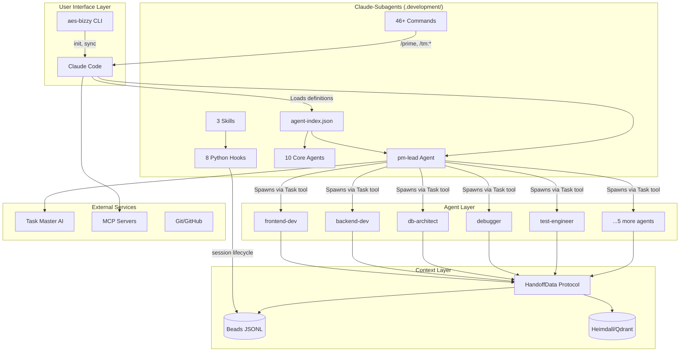

---

## Core Architecture Diagrams

### 1. User Request to Result Flow

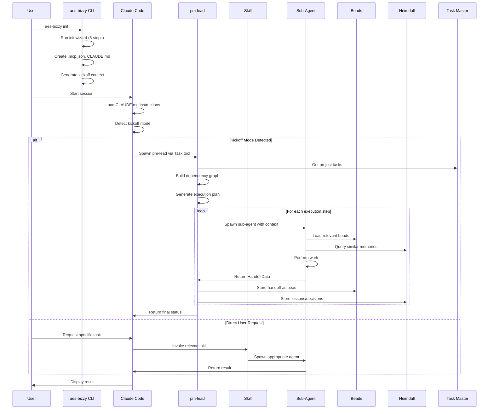

### 2. CLI Entry Point Flow

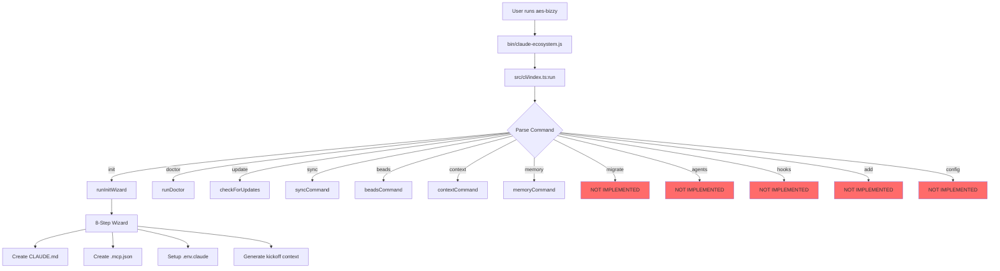

### 3. Agent Spawning Mechanism

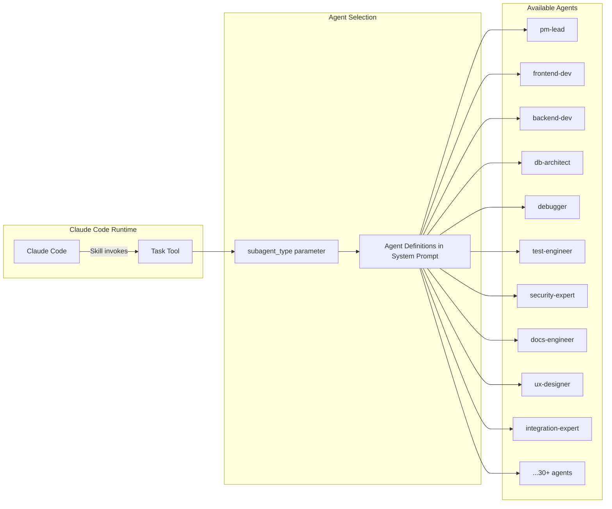

### 4. Context Management Flow

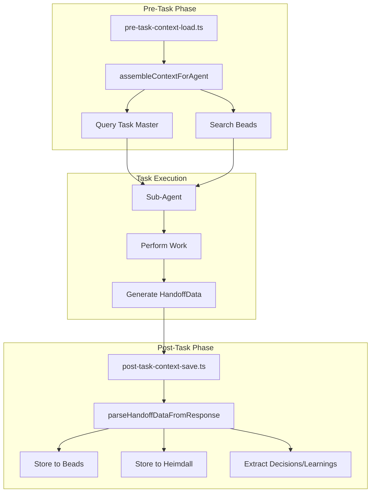

---

## Component Deep Dive

### 1. CLI System (`src/cli/`)

**Entry Point:** `src/cli/index.ts`

| Command | Status | Handler | Description |
|---------|--------|---------|-------------|
| `init` | Implemented | `runInitWizard()` | 8-step project setup wizard |
| `doctor` | Implemented | `runDoctor()` | System health check |
| `update` | Implemented | `checkForUpdates()` | Check for CLI updates |
| `sync` | Implemented | `syncCommand()` | Sync repo configurations |
| `beads` | Implemented | Sub-commands | Context bead management |
| `context` | Implemented | Sub-commands | Context assembly operations |
| `memory` | Implemented | Sub-commands | Heimdall memory operations |
| `migrate` | **NOT IMPLEMENTED** | - | Project migration |
| `agents` | **NOT IMPLEMENTED** | - | Agent management |
| `hooks` | **NOT IMPLEMENTED** | - | Hook configuration |
| `add` | **NOT IMPLEMENTED** | - | Add components |
| `config` | **NOT IMPLEMENTED** | - | Configuration management |

**Init Wizard Steps:**
1. Prerequisites check
2. Credentials setup
3. MCP server selection
4. Repository sync configuration
5. Beads context setup
6. Task Master integration
7. Gitignore updates
8. Summary display

### 2. Agent System

**Spawning Mechanism:**
- Agents are spawned via Claude's built-in `Task` tool
- The `subagent_type` parameter selects the agent type
- Agent definitions are provided in Claude's system prompt (not in this codebase)
- This codebase provides templates and context for agent behavior

**Agent Template Structure (`templates/agents/AGENT_TEMPLATE.md`):**
```yaml
---
name: <agent-name>
description: <agent-description>
tools: [Read, Write, Edit, Bash, ...]
---
```

**Required Beads Workflow:**
```bash
bd ready    # Signal readiness, receive context
bd update   # Checkpoint progress
bd close    # Complete with handoff
bd sync     # Sync to shared storage
```

### 3. Skills System

**Location:** `templates/skills/`

Skills are markdown files that provide workflow instructions for agents. They are invoked via Claude's `/skill-name` slash command syntax.

**Key Skills:**

| Skill | Purpose | Triggers |
|-------|---------|----------|
| `kickoff.md` | Start autonomous orchestration | Session start with kickoff mode |
| `orchestrate.md` | Resume pm-lead monitoring loop | Manual invocation |
| `prime.md` | Load context for new session | `/prime` command |
| `question.md` | Answer codebase questions | `/question` command |

**Skill Invocation Flow:**
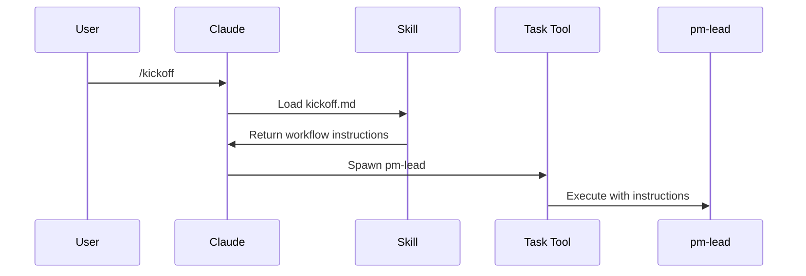

### 4. Hooks System

**Location:** `src/hooks/`

| Hook | Trigger | Function |
|------|---------|----------|
| `pre-task-context-load.ts` | Before agent task starts | Load relevant context from Beads + Task Master |
| `post-task-context-save.ts` | After agent task completes | Save HandoffData to Beads and Heimdall |

**Pre-Task Hook Flow:**
```typescript
preTaskContextLoad(taskId, agentType, options) → {
  1. Call assembleContextForAgent()
  2. Get Task Master context via CLI
  3. Search Beads for relevant context
  4. Deduplicate and sort by relevance
  5. Truncate to token budget
  6. Return formatted context bundle
}
```

**Post-Task Hook Flow:**
```typescript
postTaskContextSave(taskId, agentType, handoffData, options) → {
  1. Store handoff as interaction bead
  2. Extract decisions as separate beads
  3. Extract learnings as separate beads
  4. Optionally store to Heimdall for long-term memory
}
```

### 5. Beads Context System

**Storage:** `.beads/interactions.jsonl` (project-level) or `~/.beads/` (global)

**Data Structure:**
```typescript
interface ContextBead {
  id: string;                    // UUID
  title: string;                 // Bead title
  description?: string;          // Optional description
  content: string;               // Main content
  contextType: ContextType;      // 'decision' | 'architecture' | 'pattern' | ...
  scope: ContextScope;           // 'project' | 'global'
  tags: string[];                // Tag prefixes: agent:, task:, tech:, etc.
  createdAt: string;             // ISO timestamp
  updatedAt: string;             // ISO timestamp
  relatedTasks?: string[];       // Task Master task IDs
  relatedAgents?: string[];      // Agent names
}
```

**Key Operations:**
- `createContext()` - Create new bead
- `searchContext()` - Semantic search with tag filters
- `listContext()` - List beads with pagination
- `listTags()` - Get tag summary
- `exportBeadsToJson()` - Export for backup

### 6. HandoffData Protocol

**Purpose:** Structured communication between agents during task handoffs.

```typescript
interface HandoffData {
  taskId: string;
  taskTitle: string;
  agent: string;
  status: 'success' | 'partial' | 'blocked' | 'failed';
  summary: string;
  filesModified: string[];
  filesCreated: string[];
  decisions: Array<{
    decision: string;
    rationale: string;
  }>;
  contextForNext: string;
  blockers?: string[];
  nextSteps?: string[];
  learnings?: string[];
}
```

**Extraction from Agent Response:**
```typescript
parseHandoffDataFromResponse(response) → {
  1. Look for ```json or ```handoff blocks
  2. Parse JSON content
  3. Validate against HandoffData schema
  4. Return structured data or undefined
}
```

### 7. Orchestration Engine

**Location:** `src/utils/orchestrator.ts`

**Key Functions:**

| Function | Purpose |
|----------|---------|
| `buildDependencyGraph()` | Create adjacency list from task dependencies |
| `detectCircularDependencies()` | DFS-based cycle detection |
| `topologicalSort()` | Order tasks respecting dependencies |
| `detectFileOverlaps()` | Prevent parallel agents from editing same files |
| `generateExecutionPlan()` | Group tasks into parallel execution steps |
| `generateAgentPrompt()` | Create context-rich prompt for sub-agent |

**Execution Plan Generation:**
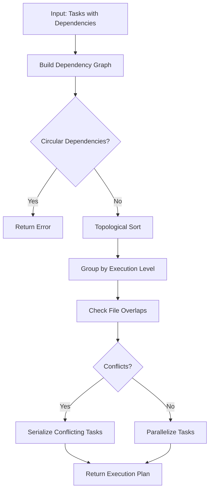

---

## Claude-Subagents System

**Location:** `.development/claude-subagents/`

This is a **critical component** that contains the actual agent definitions, hooks, skills, and commands. It operates as a separate repository (has its own `.git`) that provides the runtime behavior for the A.E.S - Bizzy system.

### Directory Structure

```
.development/claude-subagents/
├── agents/
│   ├── core/                    # 10 core agent definitions
│   │   ├── pm-lead.md          # Master orchestrator
│   │   ├── frontend-dev.md     # Frontend specialist
│   │   ├── backend-dev.md      # Backend specialist
│   │   ├── db-architect.md     # Database specialist
│   │   ├── debugger.md         # Debugging specialist
│   │   ├── test-engineer.md    # Testing specialist
│   │   ├── security-expert.md  # Security specialist
│   │   ├── devops-engineer.md  # DevOps specialist
│   │   ├── docs-engineer.md    # Documentation specialist
│   │   ├── code-reviewer.md    # Code review specialist
│   │   └── memory-integration.md
│   ├── meta/
│   │   └── agent-creator.md    # Meta-agent for creating new agents
│   └── README.md
│
├── commands/
│   ├── essential/               # Core slash commands
│   │   ├── prime.md            # /prime - Load session context
│   │   ├── git_status.md       # /git_status - Repository status
│   │   └── question.md         # /question - Answer questions
│   ├── optional/                # Additional commands
│   │   ├── all_tools.md        # /all_tools - List tools
│   │   ├── prime_tts.md        # /prime_tts - Prime with TTS
│   │   └── update_status_line.md
│   ├── tm/                      # 40+ Task Master commands
│   │   ├── next-task.md
│   │   ├── list-tasks.md
│   │   ├── expand-task.md
│   │   └── ... (40+ commands)
│   └── README.md
│
├── hooks/
│   ├── essential/               # Core Python hooks
│   │   ├── session_start.py    # Load Beads context at start
│   │   ├── stop.py             # CRITICAL: Sync Beads before exit
│   │   ├── pre_tool_use.py     # Before tool execution
│   │   ├── post_tool_use.py    # After tool execution
│   │   ├── pre_compact.py      # Before context compaction
│   │   ├── subagent_stop.py    # When sub-agent completes
│   │   ├── user_prompt_submit.py
│   │   └── secret_scanner.py   # Scan for secrets in output
│   └── utils/
│       ├── common.py
│       ├── llm/                 # LLM integration utilities
│       │   ├── anth.py         # Anthropic
│       │   ├── oai.py          # OpenAI
│       │   └── ollama.py       # Ollama
│       └── tts/                 # Text-to-speech utilities
│           ├── elevenlabs_tts.py
│           ├── openai_tts.py
│           └── pyttsx3_tts.py
│
├── skills/
│   └── essential/               # Core skill definitions
│       ├── beads.md            # Beads task management skill
│       ├── task-master.md      # Task Master integration
│       └── github-issues.md    # GitHub issues skill
│
├── templates/
│   └── AGENT_TEMPLATE.md       # Template for creating agents
│
├── manifests/
│   └── agent-index.json        # Agent registry and capabilities
│
└── .claude/
    └── mcp.json                # MCP configuration for subagents
```

### Agent Registry (`agent-index.json`)

The manifest defines all available agents with their capabilities:

```json
{
  "version": "1.0.0",
  "coreAgents": [
    {
      "id": "pm-lead",
      "name": "PM Lead",
      "capabilities": ["project-management", "orchestration", "planning"],
      "tools": ["Task", "Bash", "Read", "Write", "Glob"],
      "mcpServers": ["task-master-ai", "sequential-thinking"],
      "tier": "essential"
    },
    // ... 9 more core agents
  ],
  "metaAgent": {
    "id": "agent-creator",
    "capabilities": ["agent-generation", "research", "template-validation"],
    "researchTools": ["mcp__exa__*", "mcp__ref__*"]
  },
  "stats": {
    "totalCoreAgents": 10,
    "totalMetaAgents": 1,
    "totalAgents": 11
  }
}
```

### Agent Tiers

| Tier | Agents | Usage |
|------|--------|-------|
| **Essential** | pm-lead, frontend-dev, backend-dev, debugger | Core development team |
| **Recommended** | db-architect, devops-engineer, test-engineer, security-expert, code-reviewer | Extended team |
| **Full** | docs-engineer | Complete team |

### Hook Execution Flow

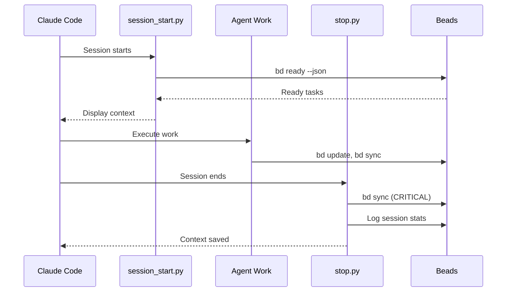

### Command Invocation Pattern

Commands are markdown files that define `/slash` commands:

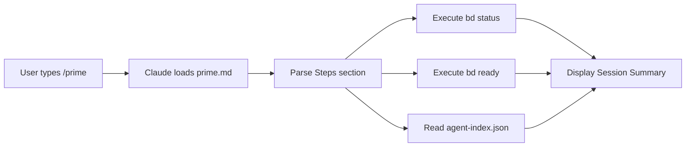

### Key Integration Points

1. **Beads CLI (`bd`)** - Primary task management interface
   - `bd init` - Initialize Beads in project
   - `bd ready --json` - Get tasks ready for work
   - `bd create` - Create new tasks with agent assignment
   - `bd sync` - CRITICAL: Save context before session end

2. **Session Lifecycle**
   - `session_start.py` → Load context from Beads
   - Work happens (agents use `bd update`, `bd create`)
   - `stop.py` → Sync all changes back to Beads

3. **Agent Assignment**
   - Tasks created with `--assign <agent-name>`
   - Agents query: `bd ready --assigned <agent-name>`

### Relationship to Main Codebase

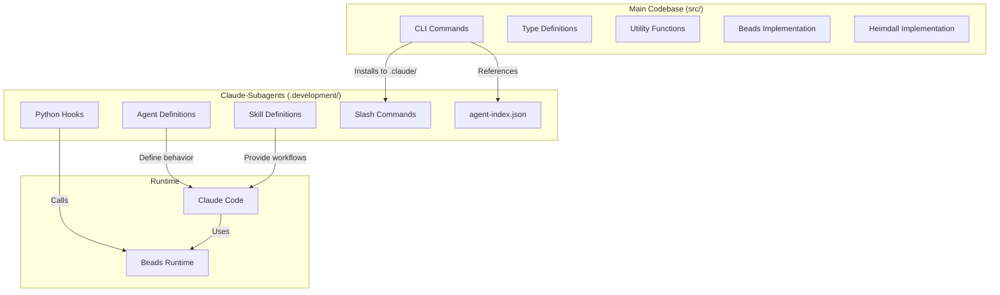

---

## Heimdall Memory System Integration

### Architecture Position

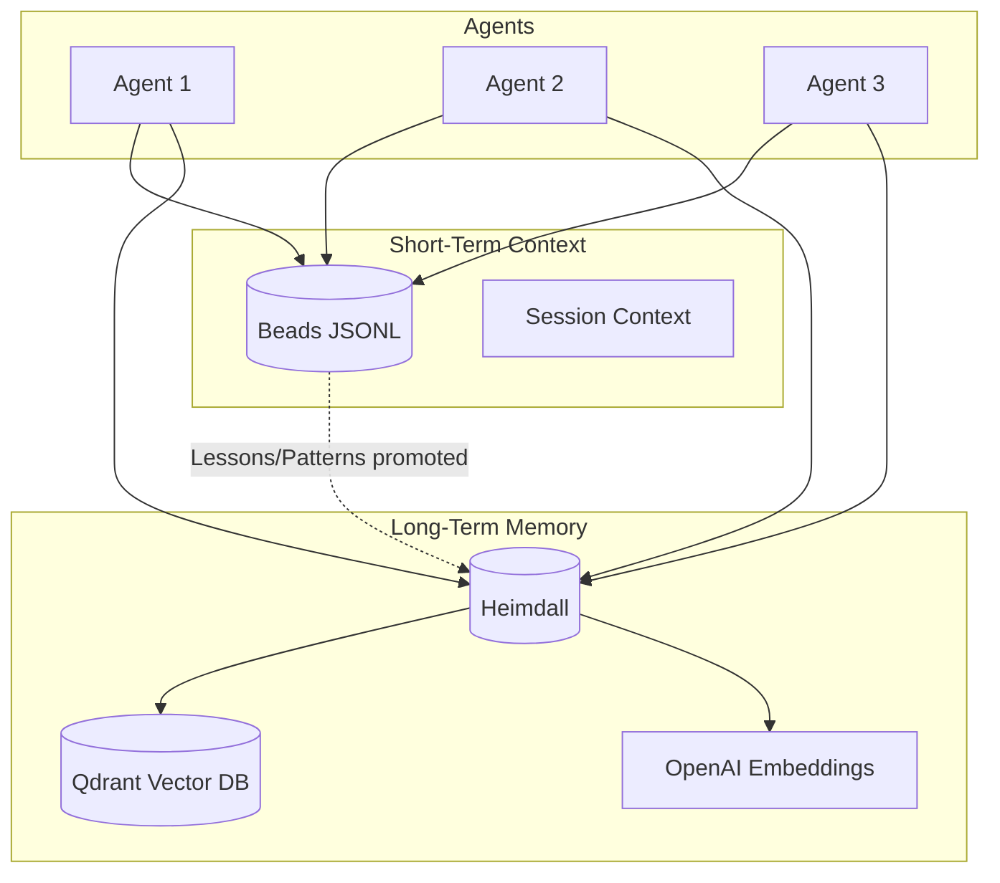

### Heimdall Components

| Component | Location | Purpose |
|-----------|----------|---------|
| Types | `src/types/heimdall.ts` | TypeScript interfaces |
| Docker Manager | `src/heimdall/docker-manager.ts` | Qdrant container lifecycle |
| Installer | `src/heimdall/installer.ts` | One-command setup |
| MCP Config | `src/heimdall/mcp-config.ts` | MCP server configuration |
| Health Checker | `src/heimdall/health-checker.ts` | Service health monitoring |
| Tagging | `src/heimdall/tagging.ts` | Tag taxonomy and validation |
| Storage Manager | `src/heimdall/storage-manager.ts` | Memory CRUD operations |
| Query Optimizer | `src/heimdall/query-optimizer.ts` | Token-efficient retrieval |

### Memory Types

| Type | TTL | Purpose |
|------|-----|---------|
| `lesson` | 90 days | Insights learned |
| `pattern` | None | Reusable solutions |
| `decision` | None | Architectural choices |
| `error` | 60 days | Error resolutions |
| `context` | 30 days | Project context |
| `snippet` | 60 days | Code snippets |
| `reference` | 90 days | External resources |

### Integration Points

1. **Post-Task Hook:** Lessons and decisions from HandoffData are stored to Heimdall
2. **Pre-Task Hook:** Relevant memories are queried and included in agent context
3. **CLI Commands:** `aes-bizzy memory` subcommands for manual operations
4. **Skill Invocation:** Skills can query Heimdall for relevant patterns

### Current Implementation Status

| Feature | Status | Notes |
|---------|--------|-------|
| Docker Qdrant management | Implemented | Via docker-manager.ts |
| Embedding generation | Implemented | OpenAI text-embedding-3-small |
| Memory storage | Implemented | Via storage-manager.ts |
| Memory query | Implemented | Semantic search with filters |
| Memory deletion | Implemented | By ID, tags, or timestamp |
| CLI integration | Implemented | memory subcommand |
| Hook integration | **Partial** | Hooks reference but may not fully execute |
| MCP server | **Placeholder** | Package `@anthropic/heimdall-mcp` not published |

---

## Gap Analysis

### Critical Gaps

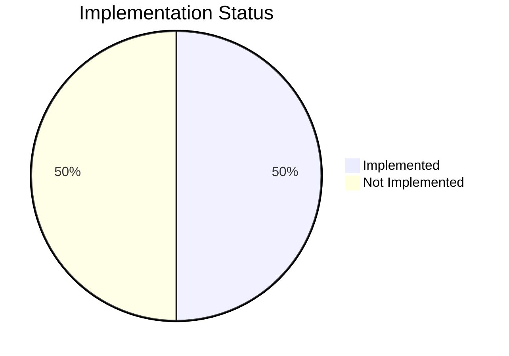

#### 1. CLI Commands Not Implemented

| Command | Expected Functionality | Impact |
|---------|----------------------|--------|
| `migrate` | Migrate between project versions | Users cannot upgrade projects |
| `agents` | Manage agent configurations | No agent customization |
| `hooks` | Configure lifecycle hooks | Hook behavior hardcoded |
| `add` | Add skills, agents, templates | No extensibility |
| `config` | Manage settings | No runtime configuration |

#### 2. Beads MCP Server

The `beads-mcp` server is referenced in configurations but:
- Package `@mcp/beads` does not appear to be published
- No actual MCP tool implementations found
- Agents cannot access Beads via MCP - only via CLI

#### 3. Heimdall MCP Server

The `heimdall` server is configured but:
- Package `@anthropic/heimdall-mcp` does not appear to be published
- Direct integration relies on REST API to Qdrant
- No MCP-based memory tools available

#### 4. Skill Execution

Skills are markdown templates but:
- No dedicated skill parser/executor in codebase
- Relies on Claude's built-in `/` command handling
- Skill invocation depends on Claude's system prompt configuration

### Medium Priority Gaps

#### 5. Hook Execution

- Hooks are defined but execution path is unclear
- `pre-task-context-load.ts` and `post-task-context-save.ts` export functions
- No clear caller/trigger mechanism in main codebase
- May rely on Claude's hook system (external)

#### 6. Agent Template Distribution

- Templates exist in `templates/agents/`
- No mechanism to register/deploy custom agents
- Agent definitions are in Claude's system prompt (external)

#### 7. Orchestration Session Persistence

- `OrchestrationSession` type defined
- No implementation for persisting sessions
- Long-running orchestrations could lose state

---

## Issues and Concerns

### 1. External Dependency Risk

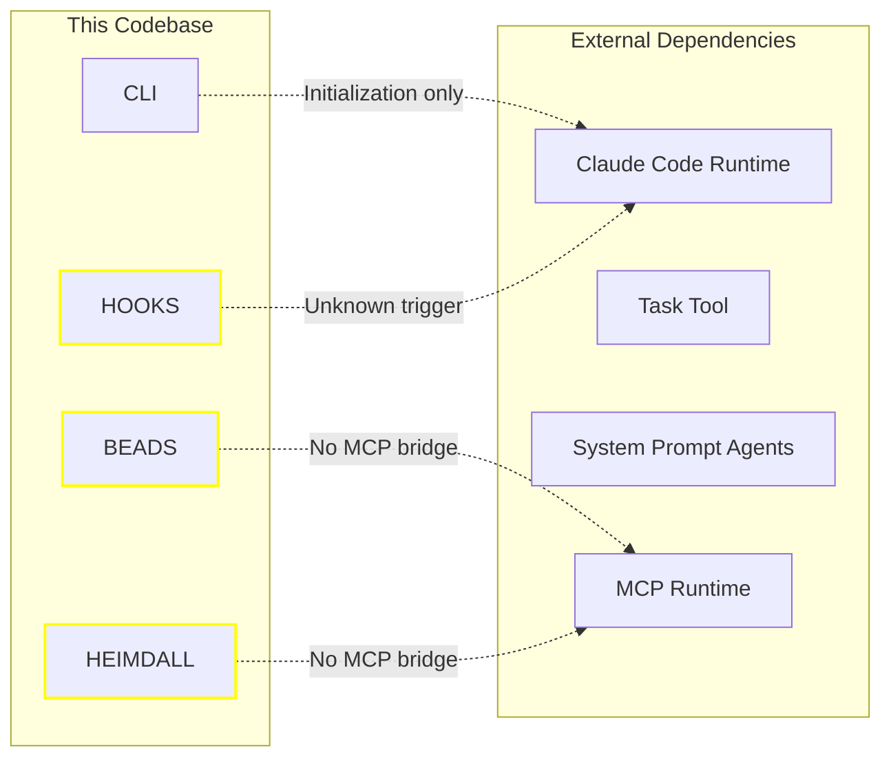

**Concern:** Core functionality depends on Claude's internal implementation which is not visible or controllable from this codebase.

### 2. MCP Package Availability

Several MCP servers reference packages that may not exist:
- `@mcp/beads`
- `@anthropic/heimdall-mcp`
- `@anthropic/exa-mcp`
- `@anthropic/ref-mcp`

**Risk:** Configuration references non-existent packages, causing MCP initialization failures.

### 3. Environment Variable Management

Multiple systems expect environment variables:
```
OPENAI_API_KEY     - Heimdall embeddings
ANTHROPIC_API_KEY  - Task Master AI
GITHUB_TOKEN       - GitHub MCP
SUPABASE_URL       - Supabase MCP
SUPABASE_KEY       - Supabase MCP
FIRECRAWL_API_KEY  - Firecrawl MCP
N8N_API_KEY        - n8n MCP
N8N_HOST           - n8n MCP
EXA_API_KEY        - Exa MCP
```

**Concern:** No unified validation that required env vars are present before operations.

### 4. Error Handling Inconsistency

```typescript
// Pattern 1: Return error object
return { success: false, error: message };

// Pattern 2: Throw exception
throw new Error(message);

// Pattern 3: Log and return undefined
console.debug('Error:', error);
return undefined;
```

**Issue:** Inconsistent error handling makes debugging difficult.

### 5. Token Budget Accuracy

Token estimation uses character-based approximation:
```typescript
function estimateTokens(content: string): number {
  return Math.ceil(content.length / 4);
}
```

**Concern:** This is a rough estimate; actual token counts vary by model and content type.

### 6. Circular Dependency in Types

The types directory has complex cross-references:
- `handoff-data.ts` references `context.ts` types
- `context.ts` references `heimdall.ts` types
- Multiple files import from each other

**Risk:** Potential for runtime import issues or type resolution problems.

---

## Positive Architectural Patterns

### 1. Clean Separation of Concerns

```
src/
├── cli/          # User interface
├── beads/        # Context persistence
├── heimdall/     # Long-term memory
├── hooks/        # Lifecycle integration
├── types/        # Type definitions
├── utils/        # Shared utilities
└── installers/   # Setup logic
```

### 2. Well-Designed HandoffData Protocol

The HandoffData structure captures essential inter-agent communication:
- Clear status indicators
- File tracking for conflict detection
- Decision documentation with rationale
- Context bridging for next agent

### 3. Comprehensive Tagging System

Tag prefixes enable precise filtering:
- `agent:` - Agent-specific context
- `project:` - Project scope
- `task:` - Task Master integration
- `tech:` - Technology stack
- `pattern:` - Reusable solutions

### 4. Orchestration Algorithm

The execution planning system:
- Properly detects circular dependencies
- Uses topological sort for ordering
- Detects file overlaps to prevent conflicts
- Groups parallelizable tasks

### 5. Modular MCP Configuration

The MCP server configuration system:
- Supports both stdio and HTTP transports
- Centralizes env var requirements
- Categories servers by purpose
- Documents token cost estimates

### 6. Interactive Init Wizard

The 8-step wizard provides:
- Clear progress indication
- Guided configuration
- Sensible defaults
- Comprehensive setup in one command

---

## Recommendations

### High Priority

#### 1. Implement Missing CLI Commands

```typescript
// Priority order:
1. `config` - Enable runtime configuration changes
2. `add` - Allow adding agents, skills, hooks
3. `agents` - Manage agent templates
4. `hooks` - Configure lifecycle hooks
5. `migrate` - Support project upgrades
```

#### 2. Create Actual MCP Servers

Replace placeholder packages with real implementations:

```typescript
// beads-mcp: Expose Beads operations as MCP tools
tools: [
  'beads_search',
  'beads_store',
  'beads_list',
  'beads_tags'
]

// heimdall-mcp: Expose memory operations as MCP tools
tools: [
  'memory_store',
  'memory_query',
  'memory_delete',
  'memory_stats'
]
```

#### 3. Unified Environment Validation

```typescript
// Add to CLI startup
function validateEnvironment(): ValidationResult {
  const required = getRequiredEnvVars(configuredServers);
  const missing = required.filter(v => !process.env[v]);
  return { valid: missing.length === 0, missing };
}
```

### Medium Priority

#### 4. Hook Execution Framework

```typescript
// Explicit hook runner
class HookRunner {
  async runPreTask(taskId: string, agentType: string) {
    return preTaskContextLoad(taskId, agentType);
  }

  async runPostTask(taskId: string, agentType: string, handoff: HandoffData) {
    return postTaskContextSave(taskId, agentType, handoff);
  }
}
```

#### 5. Consistent Error Handling

```typescript
// Standard Result type
type Result<T> =
  | { success: true; data: T }
  | { success: false; error: string; code?: string };

// Use everywhere instead of mixed patterns
```

#### 6. Session Persistence

```typescript
// Persist orchestration sessions
interface SessionStore {
  save(session: OrchestrationSession): Promise<void>;
  load(sessionId: string): Promise<OrchestrationSession | null>;
  list(): Promise<SessionSummary[]>;
}
```

### Low Priority

#### 7. Token Estimation Improvement

Consider using tiktoken library for accurate counts:
```typescript
import { encoding_for_model } from 'tiktoken';
const enc = encoding_for_model('gpt-4');
const tokens = enc.encode(text).length;
```

#### 8. Type Restructuring

Consider restructuring types to avoid circular imports:
```
types/
├── core.ts       # Base types
├── beads.ts      # Imports core
├── heimdall.ts   # Imports core
├── handoff.ts    # Imports beads, heimdall
└── index.ts      # Re-exports all
```

#### 9. Integration Test Coverage

Add tests for:
- Full orchestration workflow
- Beads → Heimdall promotion
- HandoffData parsing edge cases
- MCP server communication

---

## Appendix: File Reference

### Source Files Analyzed

| Path | Lines | Purpose |
|------|-------|---------|
| `src/cli/index.ts` | 358 | CLI entry point |
| `src/cli/init.ts` | 1237 | Init wizard |
| `src/cli/sync.ts` | 502 | Repo sync |
| `src/cli/beads.ts` | 320 | Beads subcommand |
| `src/cli/context.ts` | 686 | Context subcommand |
| `src/cli/memory.ts` | 467 | Memory subcommand |
| `src/utils/orchestrator.ts` | 600+ | Orchestration logic |
| `src/hooks/pre-task-context-load.ts` | 203 | Pre-task hook |
| `src/hooks/post-task-context-save.ts` | 423 | Post-task hook |
| `src/beads/context-store.ts` | 709 | Context CRUD |
| `src/beads/context-assembly.ts` | 342 | Context assembly |
| `src/heimdall/storage-manager.ts` | 665 | Memory storage |
| `src/types/handoff-data.ts` | 340 | HandoffData types |
| `src/types/mcp-servers.ts` | 347 | MCP configurations |
| `src/utils/kickoff-context.ts` | 565 | Kickoff mode |

### Claude-Subagents Files Analyzed

| Path | Type | Purpose |
|------|------|---------|
| `.development/claude-subagents/agents/core/pm-lead.md` | Agent | Master orchestrator definition |
| `.development/claude-subagents/agents/core/*.md` | Agent | 10 core agent definitions |
| `.development/claude-subagents/agents/meta/agent-creator.md` | Agent | Meta-agent for creating agents |
| `.development/claude-subagents/manifests/agent-index.json` | Manifest | Agent registry with capabilities |
| `.development/claude-subagents/hooks/essential/session_start.py` | Hook | Load Beads context at session start |
| `.development/claude-subagents/hooks/essential/stop.py` | Hook | CRITICAL: Sync Beads before exit |
| `.development/claude-subagents/hooks/essential/*.py` | Hook | 8 Python lifecycle hooks |
| `.development/claude-subagents/skills/essential/beads.md` | Skill | Beads task management skill |
| `.development/claude-subagents/skills/essential/*.md` | Skill | 3 essential skill definitions |
| `.development/claude-subagents/commands/essential/*.md` | Command | 3 core slash commands |
| `.development/claude-subagents/commands/tm/*.md` | Command | 40+ Task Master commands |
| `.development/claude-subagents/commands/README.md` | Docs | Command system documentation |

### Configuration Files

| Path | Purpose |
|------|---------|
| `.mcp.json` | MCP server configuration |
| `.env.claude` | Environment variables |
| `CLAUDE.md` | Claude Code instructions |
| `.claude/KICKOFF.md` | Kickoff mode context |
| `.beads/interactions.jsonl` | Beads storage |
| `.development/claude-subagents/.claude/mcp.json` | Subagents MCP config |

---

*Document generated by architecture analysis task 69 (v1.1 - includes claude-subagents)*
